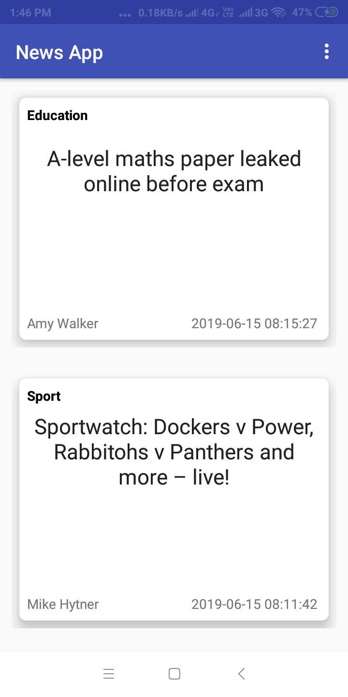
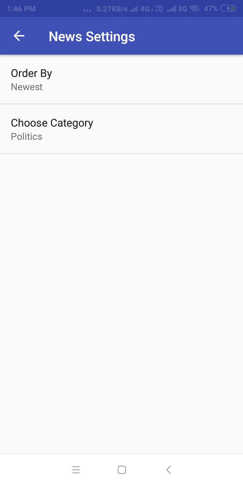
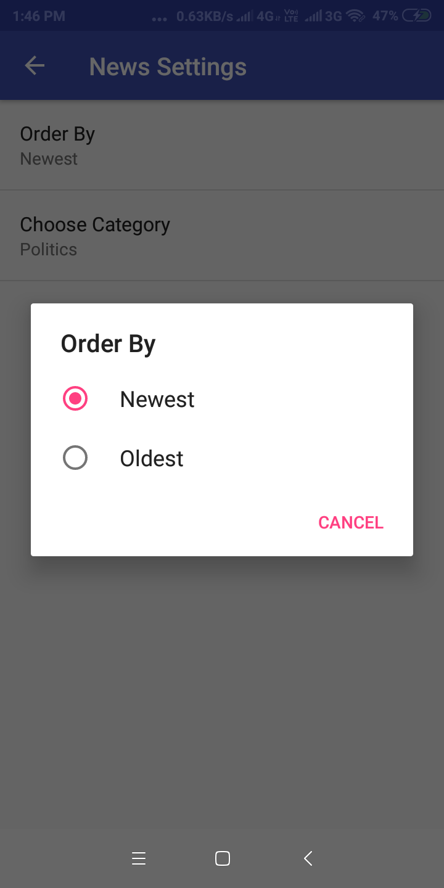
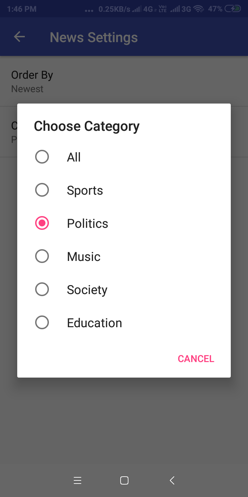

# NewsApp
* The News App for Udacity's Android Basics Nanodegree by Google.
* https://in.udacity.com/

# API
I have taken the help of <a href="http://open-platform.theguardian.com/documentation/" target="_blank">Guardian API</a>.

# Screenshots
    
